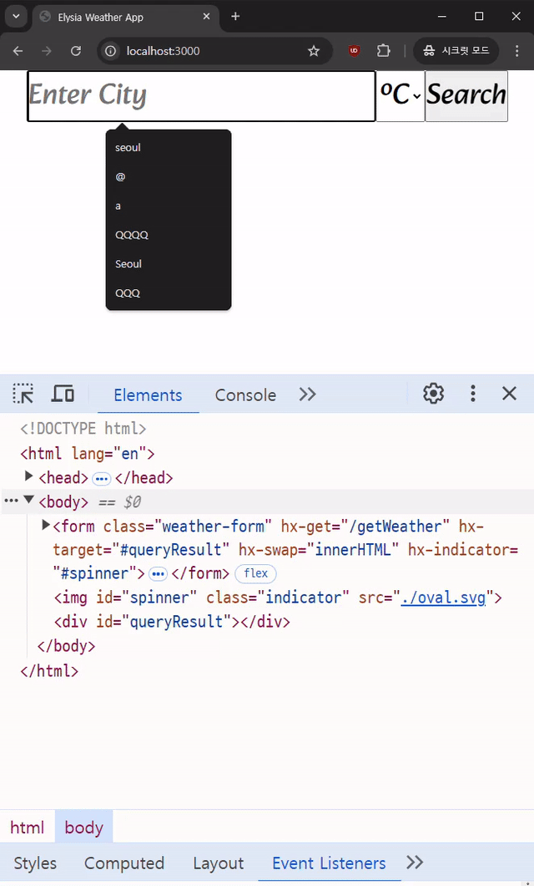

# Very simple weather app with Bun + Elysia + HTMX

## Development

```
// .env file
OPEN_WEATHER_API_KEY={YOUR_OWN_API_KEY}
```

You need to bring your own API key for openweather, then put it in `.env`.

To start the development server run:

```shell
// install dependencies and run dev server
$ bun install
$ bun run dev
```

Open http://localhost:3000/ with your browser to see the result.

## Demo
